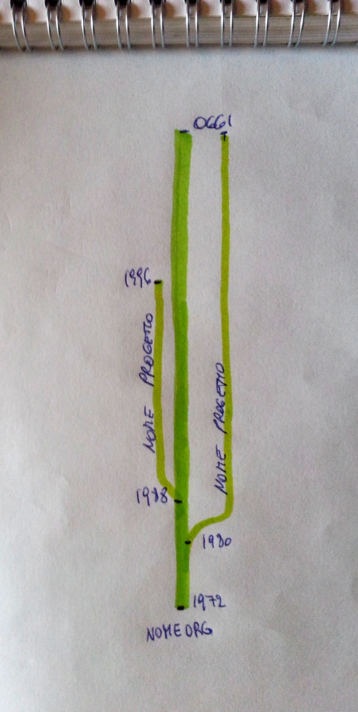
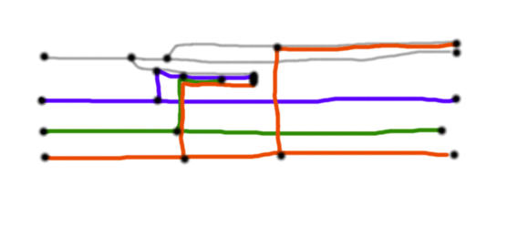
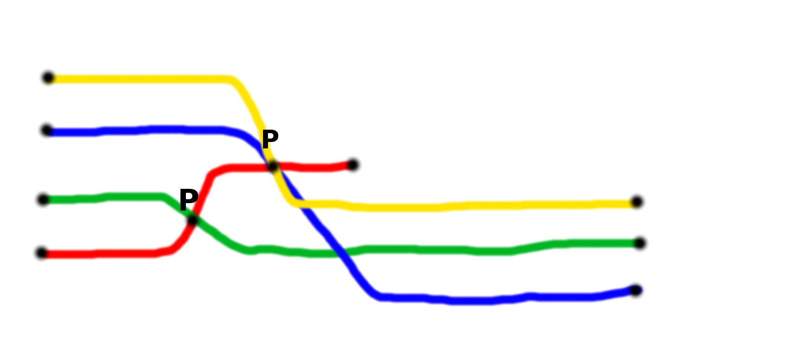
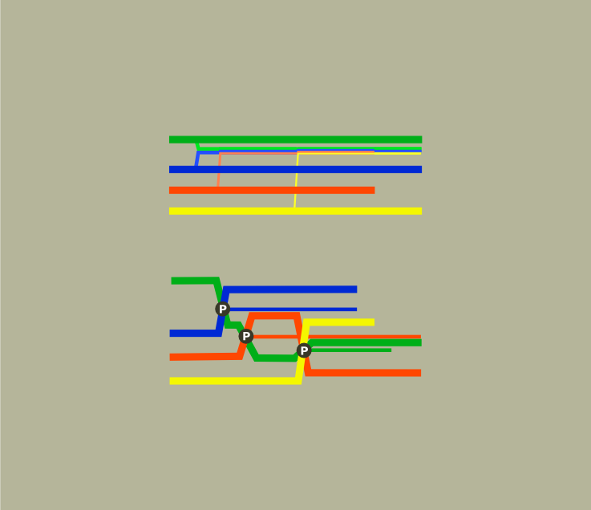
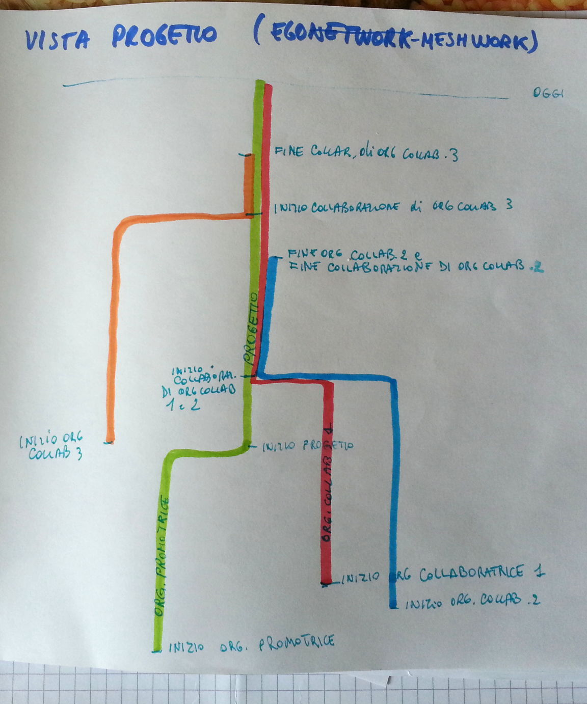

rbv_meshwork
============

Retebuonvivere: meshwork d3 visualization

Description
-----------
This repository is a workshop for the creation of a [d3][2] visualization to be used in [retebuonvivere][0] project.

Goals
-----
We want to:
1. Create a meshwork visualization for retevuonvivere project
2. Create a meshwork visualization algoritm for displaying dynamic networks

Meshwork
--------
The traditional way to visualize dynamic networks - which are networks changing through time - is to add a timeline object which commands a movie of the network.

We want to display the evolution of a network - a graph - on a single static screen. In order to do it we propose to follow the meshwork idea explained by anthropologist Tim Ingold in his 2011 book *[Being Alive: Essays on Movement, Knowledge and Description][4]*. 

The idea is fairly simple: invert nodes with edges! Traditionally network graphs display data subjects as nodes - *circles* (eg. people as nodes-circles) and data relations as edges - *lines* (e.g. "friends with" relations as edges-lines). The resulting graph is a timeless visualization of interconnected nodes, and focuses on nodes, hence on subjects. 

In the meshwork visualization we want to assign data subject to *lines*, and data relations to *circles*. This way a node-line can be displayed in a temporal way, starting from one side of the screen, extending to the other. And when that node-line has a relation to another node-line, they intersect together. This visualization focuses more on interweaving, intertwining, entanglement. The meshwork, incorporating time in the visualization, doesn't need a timeline to be scrolled or a movie to be played.

You can follow this idea in some mockup images , , , , .

Tools
-----
We are going to export the data from a MySQL database via json, import them into a [d3 javascript library][2] and visualize on the browser. The want to make the visualizing meshwork algorithm open, to be implemented in other network apps such as [gephi][3].

Data structure
--------------
| Data Object          | SVG Object | Description                                 |
| -------------------- | ---------- | -----------                                 |
| Organization nodes   | Lines      |                                             |
| Projects nodes       | Lines      |                                             |
| Events nodes         | Circles    | Circles as milestones in organization lines |
| Collaborations nodes | Intersections | Not visible, two organizations-lines intersect each other if they have a collaboration, and in the intersection point there is the project line |

Submodule of
------------
This repository is a submodule of [retebuonvivere][0]

[0]: https://github.com/fonzy85vr/retebuonvivere
[1]: http://www.retebuonvivere.org
[2]: http://d3js.org/
[3]: https://gephi.github.io/
[4]: http://geactblog.files.wordpress.com/2012/03/tim_ingold-being_alive__essays_on_movement_knowledge_and_description__-routledge2011.pdf
