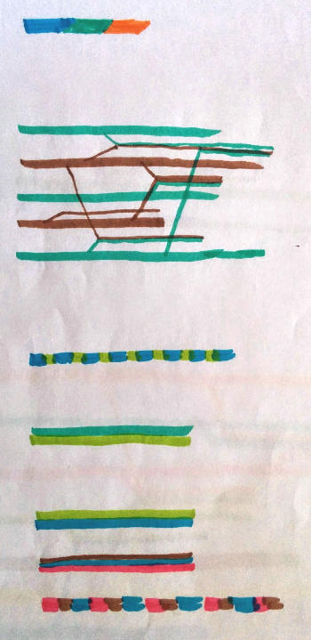
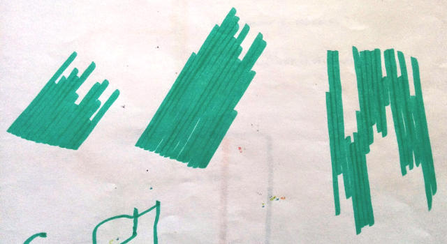

ketches

You can follow this idea in some mockup images:

* Organization line 

  
  
* Some organizations drawn together with project lines starting from intersections (projects lines are an entanglement of organization threads)  
  
  , , , 

* Project ego-meshwork
  
  .

* Lines details
  
  , , .
